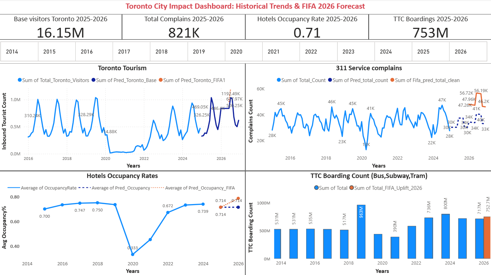
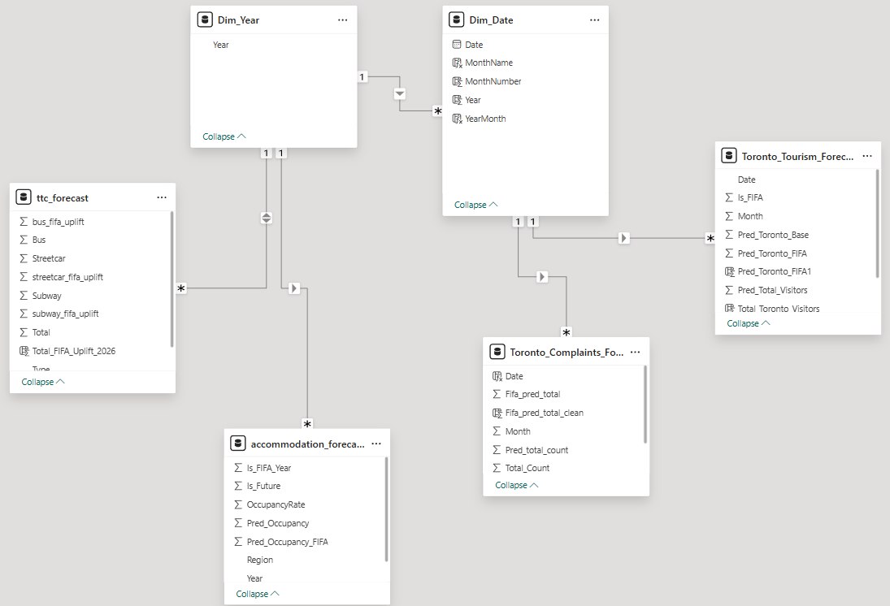
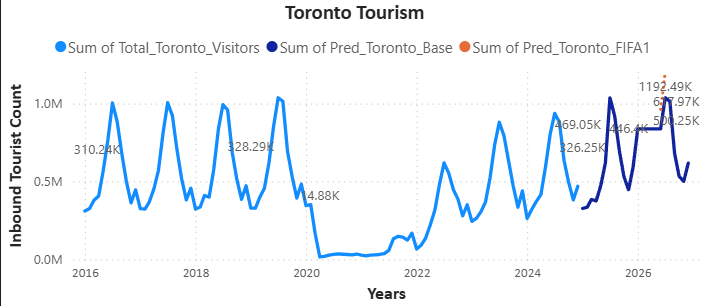
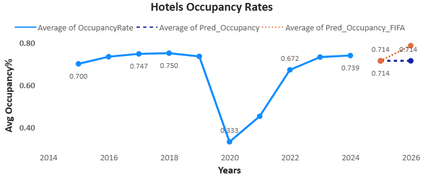
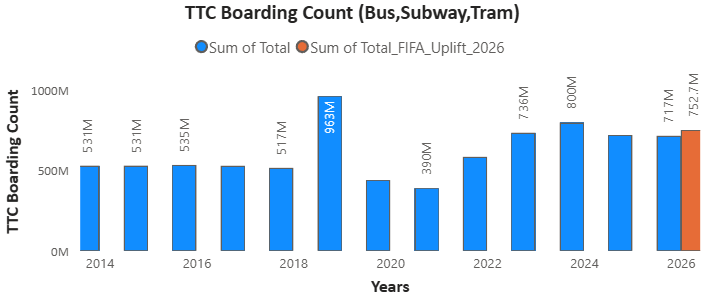
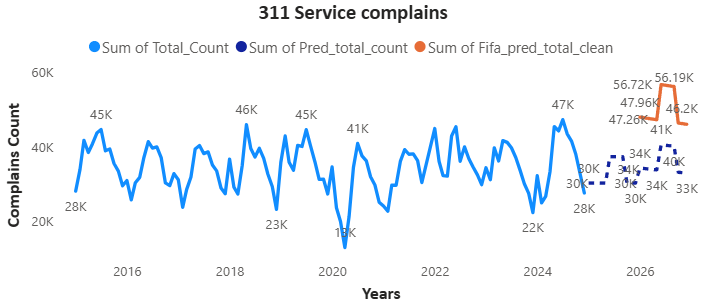

# Toronto Tourism Impact Analytics: FIFA 2026 Predictive Impact Framework

*Figure 1: Predictive Dashboard showing historical trends and FIFA 2026 scenarios.*

A predictive analytics framework forecasting tourism's impact on Toronto's infrastructure for the FIFA World Cup 2026.

## Project Overview
This project analyzes how tourism in the City of Toronto impacts four key urban indicators: **Tourist Demand**, **Accommodation Pressure**, **Transportation Strain**, and **Resident Sentiment**. Using a decade of historical data (2014–2024), the project provides a predictive framework to forecast city-wide needs for the **FIFA World Cup 2026**.

## Analytical Framework
To ensure the project addresses the complex needs of municipal stakeholders, the analysis was structured across four distinct analytical levels:  
* **Descriptive:** Auditing historical trends, such as the 75% pre-pandemic hotel occupancy peak (2018) and origin-based visitor distributions.
* **Diagnostic:** Identifying the drivers behind data fluctuations, including the impact of major festivals (TIFF, CNE) and the growth of 18,000+ Airbnb listings on local housing.
* **Predictive:** Utilizing ML models to forecast a 16.15M visitor base and simulating a 15% FIFA uplift to project a peak of 1.19M arrivals.
* **Prescriptive:** Generating data-driven strategies for transit resource allocation and community engagement to maintain long-term tourism sustainability.  

## Data Modeling & Schema
To support cross-KPI analysis, the project utilizes a **Star-Schema Semantic Model**. This design ensures that all four KPI fact tables are linked to a unified temporal backbone.

*Figure 2: Entity Relationship Diagram (ERD) showcasing fact-to-dimension relationships.*

**Schema Highlights:**
* **Centralized Dimensions:** `dim_date` and `dim_year` provide a consistent timeline for slicing data across different domains.  
* **Fact Table Integration:** Links tourism arrivals, TTC ridership, hotel occupancy, and 311 service requests into a single analytical environment.  
* **Integrity:** One-to-many relationships ensure clean filter propagation and prevent data ambiguity during scenario toggling.

## Key Performance Indicators (KPIs) & Forecasts (2025-2026)
* **Tourist Demand**: Predicted **16.15M** base visitors for the 2025-2026 period.

*Figure 3: Historical international arrivals and predictive modeling.*
* **Accommodation Pressure**: Average hotel occupancy rate forecasted at **0.71 (71%)**.

*Figure 4: Comparative analysis of hotel occupancy rates showing a projected increase under high-demand event scenarios.*
* **Transportation Strain**: Projected **753M** total TTC boardings.

*Figure 5: Annual boarding totals and forecasted ridership uplift highlighting transit system pressure during mega-events.*
* **Resident Sentiment Index (RSI)**: Anticipated increase in municipal service requests (311) related to city operations.

*Figure 6: Forecasted uplift in 311 service requests simulating resident sentiment and urban strain during the World Cup.*

## "What-If" Scenario: FIFA 2026 Uplift
A central feature of the framework is a stress-test multiplier to simulate the impact of a global influx during match months:
* **International Visitor Arrivals**: +15% increase.
* **Hotel Occupancy Rate**: +10% increase.
* **TTC Ridership**: +5% increase.
* **Resident Complaints (RSI)**: +40% increase.

## Data Pipeline Architecture
The analytical pipeline follows a structured, multi-layer approach to ensure data integrity and reproducible forecasting:  
* **Ingestion Layer:** Raw datasets are collected from primary systems of record, including Statistics Canada, Destination Toronto, TTC, and 311 Toronto .
* **Transformation Layer:** Data cleaning and standardization performed using Python and Power Query. This involves unpivoting wide formats to long formats and aligning disparate frequencies (daily/monthly/yearly) to a consistent temporal timeline.
* **Modeling Layer:** Analytics-ready tables are used to train machine learning models (Decision Tree, Random Forest) and generate the FIFA uplift scenarios.
* **Visualization Layer:** Model outputs are imported into Power BI for interactive reporting and decision-support. 

## Data Integrity & Volatility Management
Handling real-world, fragmented datasets required a rigorous approach to data veracity and stability:  
* **Anomaly Management:** Identified and reviewed extreme outliers, specifically the 2020–2021 pandemic period, ensuring these "external shocks" did not skew the long-term 2026 forecast.
* **Temporal Standardization:** Standardized disparate data frequencies (daily 311 requests vs. monthly tourism arrivals) into a unified year-month timeline to enable accurate cross-KPI correlations.
* **Validation Protocols:** Used a time-based train-test split (training on 2015–2023 data and testing on 2024) to preserve the natural chronology of ridership and occupancy patterns.

## Modeling Deep-Dive & Evaluation
To ensure forecast reliability, the following evaluation metrics were used across all models:
* **Tourist Demand (Decision Tree)**: Captured non-linear seasonality; validated with **R²** and **RMSE** to ensure peak arrivals (1.19M) were statistically significant.
* **Transportation Strain (Random Forest)**: Adjusted `n_estimators` and `max_depth` to reduce variance while managing computational cost.
* **Veracity Check**: All data sources were cross-verified against official Statistics Canada and City of Toronto open data portals to ensure credibility.

## Strategic Insights & Business Value
The framework translates model outputs into actionable recommendations for city planners and industry partners:  
* **Transit Optimization:** Forecasted a 5% ridership uplift for FIFA 2026 match months, identifying specific corridors where increased frequency is necessary to maintain service levels.
* **Resident Engagement:** Predicted a 40% surge in municipal service complaints (RSI) during peak event months, highlighting the need for proactive communication regarding noise and traffic congestion.
* **Market Planning:** Identified that hotel occupancy is expected to reach near-capacity levels (~80%) during mega-events, supporting the case for targeted short-term rental regulation and hotel expansion incentives.  

## Future Enhancement Roadmap
The platform is designed to be sustainable and adaptable for future urban planning needs:  
* **Advanced Modeling:** Exploring the transition from traditional regressors to Prophet or LSTM neural networks to capture higher-order non-linear seasonality.
* **Real-Time Integration:** Incorporating real-time transit telemetry and social media sentiment analysis to broaden the Resident Sentiment Index beyond municipal request data.
* **Granular Data Expansion:** Integrating daily airport arrival data and inter-regional travel patterns to further refine transportation and accommodation precision.

## Technical Stack
* **Modeling**: Python (Pandas, Scikit-learn).
* **Data Preparation**: SQL, Power Query.
* **Visualization**: Power BI.
